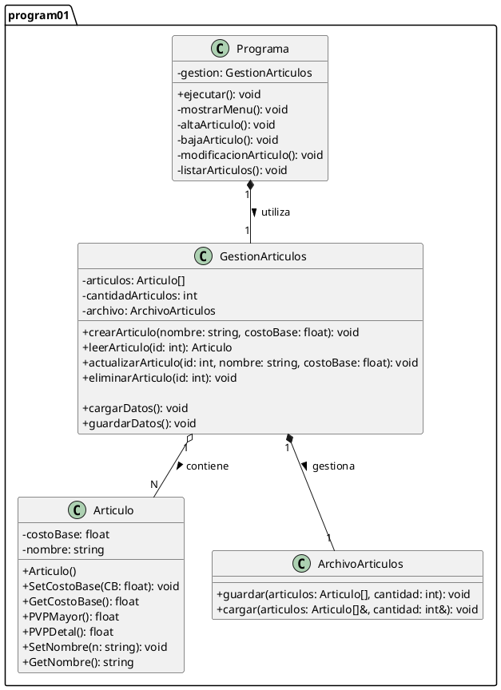

# Diagrama de Clases - Programa 01 (Articulo)

## 1\. Código PlantUML (textuml) del Sistema

Este diagrama modela la clase `Articulo` y el "Programa" completo (con las clases `Programa`, `GestionArticulos` y `ArchivoArticulos`), diseñado para cumplir con todos los [requerimientos funcionales y no funcionales](04-projects/prj-tecnicatura-superior-sistemas/year/01/algoritmos-y-estructuras-de-datos-i/30-assignments/32-laboratorio-paradigma-orientado-objetos/code/core-service/docs/program-01/software-requirements-specification.md).

-----

## 2\. Diagrama de Clases (PlantUml)

[](https://editor.plantuml.com/uml/bLRDJjj04BxxAKOvW5CI2KefaW-8aBG82QA8b5wggfhO4xFKtdLtrv42wiFq6NW4NgnZEt4siQceBojvVhwPRxvP-znOr3PF4syVXahEHPnh3CNBiuGCDK8k8H8OQqmHqfS_1XAHPa9vvgUGXKCAOOB63ApLOfPRkWgLd8f7WaFlNaG4b6Ps-IEbT4RQU0noE_xSFpm9O90b8aGDdqp6UCe0EuzLEjDaF8af5Qy9CgqAxCCZUF8yu6ULuAXNdSS1JAceeogPSt1yfgJ1cKX4X14Py6zKH8agZ2EqodJBH6NPCD1MX3aRdygNnTE7K1chBj1G0FD4eQrD-p3EQQ40gsOL6CLD28kHSi9bsKK0XhraxDMMWnhDxpelfsI7Qq1_UB72x0QmK29o_2vTl-vkQGSm-JgvmQNIhzX6P35fip5-nRilrpMtWg-SkdLZXUNtMwRYJtZsmbYIeS1jziDxiL1hMempXNsuHWDpeLC-f88Gqvb0sOCbmg-SG6MaKV80k2QW1DJiWNWWwrHEwN6EEaBjunebgBs-VUznOcaBeGGWP0lhBD7ujU2zdUWzD_njp5o_FCUy1gNuALQy22u_bsIiKBATdpBVQP4FSbCkAcgDorx1rlJBjIF8rk9TlQ-Q66pyk9kj1EMSWiR0QX-thbMxVBolZkFg-03-yFPkr6q6CSsQKDVhiRr1lSP2DiUK46t2HJtC5ZbWQ7DCn2Cs_7lm_xZ4rw6GpLoxdZlyd5ICV6m8hRoW_2REIiHDyzjaTYKjwJa-5ZgxCvnhMsUJwfR5hLimhiGND5JODZzwe33dBqcZz3waJA96VKCoRx5YOd5pBJRCCtpubpbLaPZp_eHEVIrkYIY-SdK3xGIEQ2waSBuZIPcMgdvhYZf77NZNxvTdOpy3oAqen0LdPLJ3mOrkt7x1clDrk3lQqteGB4lULv84dN47Dk5-kV_Tru5L0Uo4C62TwinZ8iv9Hlmhy1S0)