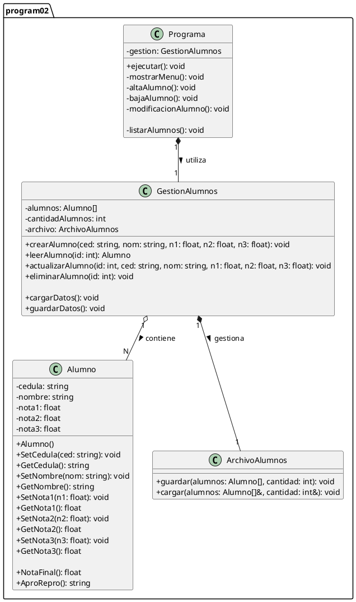

# Diagrama de Clases - Programa 02 (Alumno)

## 1\. Código PlantUML (textuml) del Sistema

Este diagrama modela la clase `Alumno` y el "Programa" completo (con las clases `Programa`, `GestionAlumnos` y `ArchivoAlumnos`), diseñado para cumplir con todos los [requerimientos funcionales y no funcionales](04-projects/prj-tecnicatura-superior-sistemas/year/01/algoritmos-y-estructuras-de-datos-i/30-assignments/32-laboratorio-paradigma-orientado-objetos/code/core-service/docs/program-02/software-requirements-specification.md).

-----

## 2\. Diagrama de Clases (PlantUml)

[![](https://img.plantuml.biz/plantuml/svg/hLRDJjj04BxxAKOvKASa4abAQNr0H50G4Y14ogcggeazCKljtMXtZKIgFaoVWKVWnJh-xSPEW4Dzo3exyytVVZFh8sDHsonDl7TmhEH2n9d6K3m_ILYYHiWaH09ZZIb2-lp7G2BIfL2U-Ibahf12cA0nKskrc6UMpaCbPs95iEVTYOY0qgLz_95IEYTjF7PoStKwtDiFOBfCH8WQlfWb-rC6MFbAfNDDnfEOKhvDiDGgzxqtXb-U1_nK1aQ3Sfq4CACyZZ9aji7ufP86vo8H4KPamBzK4IKg5vwWLQPV62h2XccIfLAnSQYU8OGKPGa6O3WZ6Ji2MKItKM1n5C0YKMXRs-FDsvDwkzdVhKBn-yxMZEnn4OtFGTME-m4yA14vQcUDMhyJNM6ahAlF2Rnef5BRQeIpz6MTw1OBkKw_dNI37_jo_1f-_09-uil9Q_X95z-yC7kOD0U3OldaO7FWgP2OR78-PHRU4F-qIlFxBPJqhvdumbYIeS0rwkdmJZoeyjYDGy5TY3FK4MeVIrbGSUFRzm64A6tEwm24t503xgXu4t2dXTnneM_Bu-BvAUQEBVgKOiKzwsPpHiOA9RlPL5OFSckGcMAYeDRuEE1EWDdN2wSrEc6xRLc5FwrrE0iNMbOpQ9Lr6mL69GN6vJ8fbm_W7z_SdhWT66f2NNMcquDvxAdpfsuAVXt_UzrErOIejYgQeomt72qCROQ9M65BTm3_CHJYWSx4xuQpfjSgttvPi8yTvXK3rkzwgHZT5R-DU-VIabxWAYVVhM5Rw-IxBcy9N9lZSSd8e4NDRafSWtiACxu7Eu4F8LLSMTIN9BCDKamirdEx8vpZ_NPXgYAnu7OAcyWwIgsQVtRGYSYlxIgZpVKyeOMGmhaMay8NbGLeAjORzU3zS5YihHuE8BCYfnyS5fYMs4MsPbbG5x-6kcTyq9m8yBU25IG9UbSzgC5-CHtwsrogt6MZpguQ8uSU9tz4CkAlcRy0)](https://editor.plantuml.com/uml/hLRDJjj04BxxAKOvKASa4abAQNr0H50G4Y14ogcggeazCKljtMXtZKIgFaoVWKVWnJh-xSPEW4Dzo3exyytVVZFh8sDHsonDl7TmhEH2n9d6K3m_ILYYHiWaH09ZZIb2-lp7G2BIfL2U-Ibahf12cA0nKskrc6UMpaCbPs95iEVTYOY0qgLz_95IEYTjF7PoStKwtDiFOBfCH8WQlfWb-rC6MFbAfNDDnfEOKhvDiDGgzxqtXb-U1_nK1aQ3Sfq4CACyZZ9aji7ufP86vo8H4KPamBzK4IKg5vwWLQPV62h2XccIfLAnSQYU8OGKPGa6O3WZ6Ji2MKItKM1n5C0YKMXRs-FDsvDwkzdVhKBn-yxMZEnn4OtFGTME-m4yA14vQcUDMhyJNM6ahAlF2Rnef5BRQeIpz6MTw1OBkKw_dNI37_jo_1f-_09-uil9Q_X95z-yC7kOD0U3OldaO7FWgP2OR78-PHRU4F-qIlFxBPJqhvdumbYIeS0rwkdmJZoeyjYDGy5TY3FK4MeVIrbGSUFRzm64A6tEwm24t503xgXu4t2dXTnneM_Bu-BvAUQEBVgKOiKzwsPpHiOA9RlPL5OFSckGcMAYeDRuEE1EWDdN2wSrEc6xRLc5FwrrE0iNMbOpQ9Lr6mL69GN6vJ8fbm_W7z_SdhWT66f2NNMcquDvxAdpfsuAVXt_UzrErOIejYgQeomt72qCROQ9M65BTm3_CHJYWSx4xuQpfjSgttvPi8yTvXK3rkzwgHZT5R-DU-VIabxWAYVVhM5Rw-IxBcy9N9lZSSd8e4NDRafSWtiACxu7Eu4F8LLSMTIN9BCDKamirdEx8vpZ_NPXgYAnu7OAcyWwIgsQVtRGYSYlxIgZpVKyeOMGmhaMay8NbGLeAjORzU3zS5YihHuE8BCYfnyS5fYMs4MsPbbG5x-6kcTyq9m8yBU25IG9UbSzgC5-CHtwsrogt6MZpguQ8uSU9tz4CkAlcRy0)