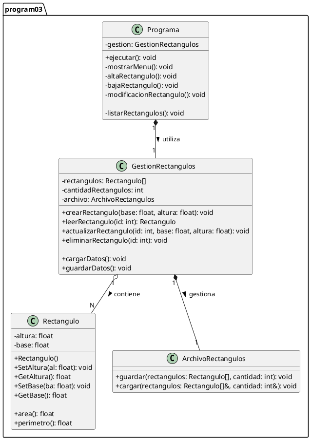

# Diagrama de Clases - Programa 03 (Rectangulo)

## 1\. Código PlantUML (textuml) del Sistema

Este diagrama modela la clase `Rectangulo` y el "Programa" completo (con las clases `Programa`, `GestionRectangulos` y `ArchivoRectangulos`), diseñado para cumplir con todos los [requerimientos funcionales y no funcionales](04-projects/prj-tecnicatura-superior-sistemas/year/01/algoritmos-y-estructuras-de-datos-i/30-assignments/32-laboratorio-paradigma-orientado-objetos/code/core-service/docs/program-03/software-requirements-specification.md).

-----

## 2\. Diagrama de Clases (PlantUml)

[](https://editor.plantuml.com/uml/bLN1Jjmm4BtdAqPxeDcoAq4ffSq1iOMsGWA4Tikfggf9CXk69dPaEqY0-Z7z1Zw17wlZx0Rl9gneBex6CsyyRvx7HzgWCbMH1s_WM8evPvN2X9yU1PIe42e1AMEci40edlvgoBaeMGRwDulQeO0aHwqdnYYEAqEdYHGplYVO2Quv9Q2YD7U_2YfYKZgmIQONNySx-n5CofmJLF15bpQVr62TBsGHAzA1m89gCq6fP9rxPmyUWW3ijm3O7JNhNWGpgi_H7DbYsFXI2eqnvvnYIXh2SvbIBklD4pHI3nsGEpPCAJ4eiifkFpXp_Oq1SsDfY62UIpIUFKPDIsjhtlPGmg5ddf6PEA0GyqNKC89RoQddzArr6gxdSmYVRSemnatnpgKJtVvOoYnJ1oEtVFH2KL5lrf8K5sIKNDtyyveEX9UspwmDYOJHPtgYack-bSzKQO_nRSWgL2cgK3tlHnwlFtwE845XwfP6mAA722kcR1F0rXh2bW_nkjhEdXupAredLSgabQrVuJVIXgNeht21V50ZGgNTnKAby6u4GiBi-vcdiXTBy7oMfKnzNrkLB-A6yQY7-fT4ijk8v5spx3NBUmYFfrSdlh8JgnpbgTwx5wFLozFjKqxaXtBRpsUZhz74L9ZpFVR4ZE1_yfATN2pwSDPzrqZPRsZuqD6QcoPXDzD2oztjrwdiL1XISxolPNQbBTQgp2wRaOWh0ojhj1VrYB1RbkNYXfBA3lxEuSTGI6qKgdCILS-kvHZzQTTnYF5ciqCXKvxRIvIidBBZkDQ3Jnv2plMRvLNOp_49pLcmzoxaBYSrXBGi3dO7y7OyTclF3OwWCbph3mvTN8-BZz0pvQ9bSvOGlWOEsew1VJWDao0ON0p01mZTd1XkIY_hz2jXDcqBU1XOKev8fFQP_mS0)
