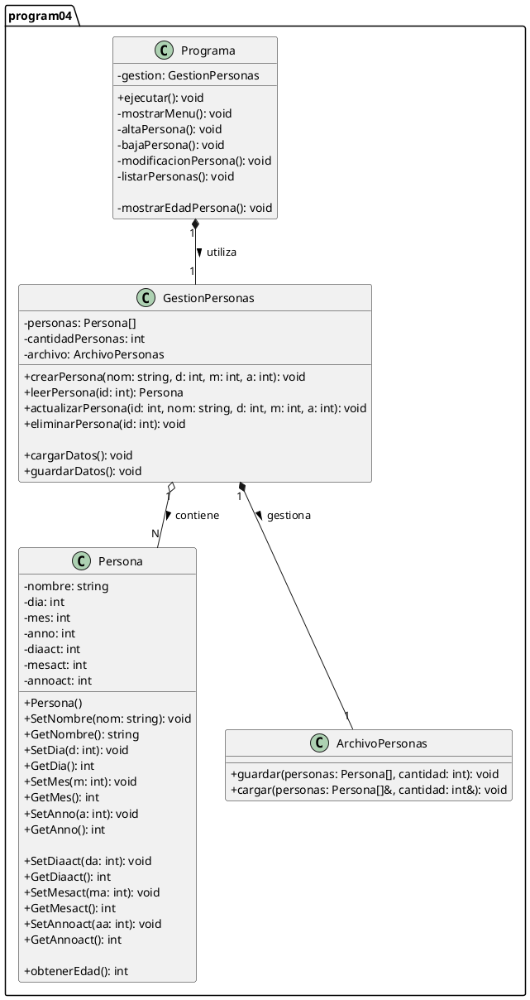

# Diagrama de Clases - Programa 04 (Persona)

## 1\. Código PlantUML (textuml) del Sistema

Este diagrama modela la clase `Persona` y el "Programa" completo (con las clases `Programa`, `GestionPersonas` y `ArchivoPersonas`), diseñado para cumplir con todos los [requerimientos funcionales y no funcionales](04-projects/prj-tecnicatura-superior-sistemas/year/01/algoritmos-y-estructuras-de-datos-i/30-assignments/32-laboratorio-paradigma-orientado-objetos/code/core-service/docs/program-04/software-requirements-specification.md).

-----

## 2\. Diagrama de Clases (PlantUml)

[![](https://img.plantuml.biz/plantuml/svg/dLRDJjj04BxxAKOvWDCc4hHGMXyG4Q48YI14ogcggeczCKljNMjtZGHL7wR7ddc4l5Xd_SVY7ugQoqOpyytVVZFh8srGcJnDl6qubcBDurnXo3UF0Z9K2Bc0Y6EiC4L8Dxyr93pDkFJq3owiGGfXWbhFZ55ybHjs5agnv0yCThmR7Z5WQMRklwSiNJ6bFGfoTV5vkhCVm2nBU8WAJdH6yQG6ChwGwKenxGbCcHKpo9IqiNVsuAVd0Vqg1xkJydmVm9BPFCgKoGVXCoaqhdZ28uoO1dyX8vP8gvoZaNfSE2hIXalAIWeaxr3zfY2AB0BGL9A87GKr8W0kZ2EYFDiY54AsPOJ4qFI0UwGMtuWR-TiwLN_io9RCb3tpAUawut40Tv97ZjbfOpRkb5KucNFqeo9YBzYgny_pB60Bflrq66RLVR0PLUZZCAxGju3D7o80tVj108lD7oCZ8ax1qmHXpS8R16fTZacdF1BxqGinAvE1AgqgVG5TcGmLQtNuZu9xyAsQFpeWkJ9CC7L237THlrup9Bvb4jVa8EJe3iDCXJVyJbP4qyvGRCDIqWHb5H0IEwzsbknG2VARSYQCT1ACSrGHAZ-hd0KrVxz-cq28mjZX7EW8hOMu7xhLmcwvuDSLVxvvZ6dn5Ek6nP9MZzk2KwODbwAt1OMx0-iESbriHbGAxoUqC63vvTmPuPxC7MrTmMLZrLe0vJK4xViOueMjb8vtvV6-FFR0FxwwdhlB8bGCLRr5d7qnWRAP4qYhSuYg2MED0zxSNYLnxCePv0_OjhQz-e-uZ1uTBZhUseQjlkoNdVZGOLRn2lZTC1Ldk-hNCUjC6ARM-62fTQt9rtDgNPPFsVEt9Yxv5hI9rws9kd3BmfnUwqxcz998QYcg1HDvZnOJWythqT6kyFO5RIeZlgPv2P-Iwx5AkFsCg9Fl6BINTtandxe5d3oDHVy5pDcQ2-uyzacH6IiRrhHuj3k2DzDfSRP7Ee3SS4jEE2n0RRsBRM_4eBwm6kpoug2vHQ2F84CRaS7eOWGDsY_snNWmghHHdm0KhV5pw54BZfY8w4ljBm00)](https://editor.plantuml.com/uml/dLRDJjj04BxxAKOvWDCc4hHGMXyG4Q48YI14ogcggeczCKljNMjtZGHL7wR7ddc4l5Xd_SVY7ugQoqOpyytVVZFh8srGcJnDl6qubcBDurnXo3UF0Z9K2Bc0Y6EiC4L8Dxyr93pDkFJq3owiGGfXWbhFZ55ybHjs5agnv0yCThmR7Z5WQMRklwSiNJ6bFGfoTV5vkhCVm2nBU8WAJdH6yQG6ChwGwKenxGbCcHKpo9IqiNVsuAVd0Vqg1xkJydmVm9BPFCgKoGVXCoaqhdZ28uoO1dyX8vP8gvoZaNfSE2hIXalAIWeaxr3zfY2AB0BGL9A87GKr8W0kZ2EYFDiY54AsPOJ4qFI0UwGMtuWR-TiwLN_io9RCb3tpAUawut40Tv97ZjbfOpRkb5KucNFqeo9YBzYgny_pB60Bflrq66RLVR0PLUZZCAxGju3D7o80tVj108lD7oCZ8ax1qmHXpS8R16fTZacdF1BxqGinAvE1AgqgVG5TcGmLQtNuZu9xyAsQFpeWkJ9CC7L237THlrup9Bvb4jVa8EJe3iDCXJVyJbP4qyvGRCDIqWHb5H0IEwzsbknG2VARSYQCT1ACSrGHAZ-hd0KrVxz-cq28mjZX7EW8hOMu7xhLmcwvuDSLVxvvZ6dn5Ek6nP9MZzk2KwODbwAt1OMx0-iESbriHbGAxoUqC63vvTmPuPxC7MrTmMLZrLe0vJK4xViOueMjb8vtvV6-FFR0FxwwdhlB8bGCLRr5d7qnWRAP4qYhSuYg2MED0zxSNYLnxCePv0_OjhQz-e-uZ1uTBZhUseQjlkoNdVZGOLRn2lZTC1Ldk-hNCUjC6ARM-62fTQt9rtDgNPPFsVEt9Yxv5hI9rws9kd3BmfnUwqxcz998QYcg1HDvZnOJWythqT6kyFO5RIeZlgPv2P-Iwx5AkFsCg9Fl6BINTtandxe5d3oDHVy5pDcQ2-uyzacH6IiRrhHuj3k2DzDfSRP7Ee3SS4jEE2n0RRsBRM_4eBwm6kpoug2vHQ2F84CRaS7eOWGDsY_snNWmghHHdm0KhV5pw54BZfY8w4ljBm00)

