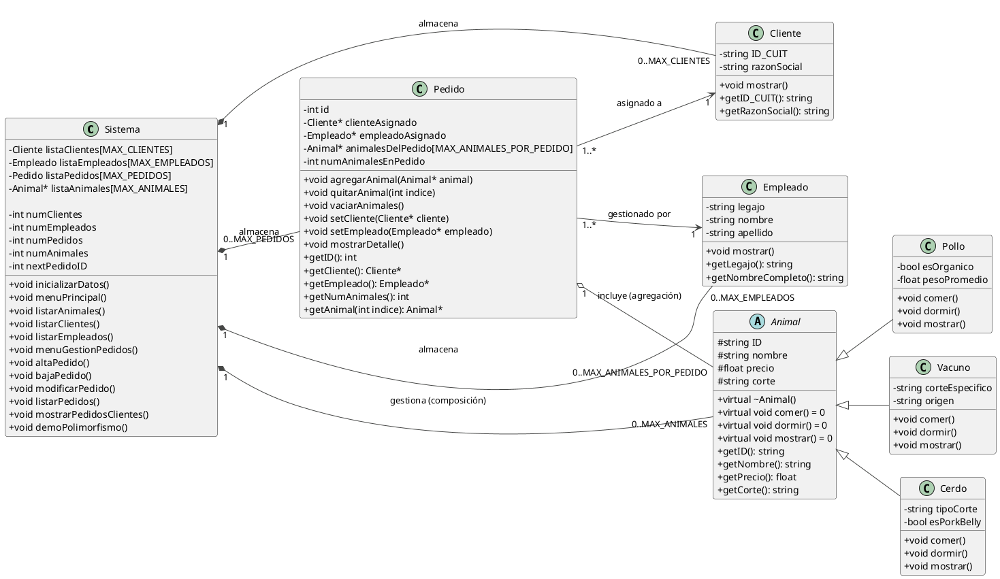

# Class Diagram 01
## TextUML

## UML
[![](https://img.plantuml.biz/plantuml/svg/hLPVRzis47_tfs3KXpWUR2UlnZhKiutDG_uOIJOKA8g0biuA6ufKIIfTqctVQ4_z2FrYEr4a9ThAK63JatXtlD_zZdT7lj66AbCLV71CnkCnkRs7Wedyg5uCZe-OI7cL0RatfjIpwLJHJvEScVjgMsbGgHG6X9caifZc5IkfKKmQEiqKJIjEnoMdelOzDkWLfezdazF9wTGk9gN5FB8BWePCX9MHJ-5VGPOfq7gSKVMmvHKCdEAHRHLw7xYu5rBiM5uXCFlwHP0CE5aocYjQK4k5mywWOw9OVcz8nXIaXaanq0zCb1JDICgfrdE35BQLWJLoks7FG4uzmX9sJ33ldYpG7BJrFR1RoGtJ1X3kyu3WDrvmXha1mb5CtKA_kvY_lLkShrUNjwkRzutXgYWvq4msbdxLcAukDkUh-VBAssuWOzwo-M_iDglbkhMQ2rPGFchCceM3db-kB-Rd7hgnPi8GKHK-n4WOeeca3ZcIUPYE47utZULwsS9zzoXPHcmcAMVFL2sfaNfuqb4M8AgDmjB3YkAHnX9I7gf7vKdqg0AL0woVGDUru5X5QifzdYFnbdxe4nSoOpkMKjMZQuBemoYaDYgeUXbaKCYDvAoGQiTqKNl-qvUThpDNTkWB-vUibtUBNzUtaKpHPongMIV-4DxZvM3Stk79Z3GxW-QwzT3HXb129SUnSCZf1nc9X2os2Y8HBO5ppC2_XdPkNVL4TcaTBcGTWP5zmRdM-TmMACkYJXtX2B0_SyroGLqaeJr71DnVhFVDHbrLBe4tK573tMskhbsNlk_jcvMhl_rEmHc6d5tD3sEmRebyh5XeZQ5b9pAMGjVa4OVZ2zsZmRWi3FUpiMVcqp4yp4jFKI_1KCuXAgxwS3308F70AFROGHVGK1a0sqDlqxVlz30HC-AILvT4Cz9_0GpnO_NrRrfFz9z10SuS--_TDlETRciogMdk2ATqbVGgD5oqx1JugnsNr90Ihnmc8wDKAWCkQGnlONJwbmly91RRdE8r2zWCv3LUIeVQJAg2lQmElTJgmsdqzbAFOcCfr0fBgJt1caTlpqdEGyjjfUG4z9NAiNfJrpqkDw3bHY6zZ7Nxtn7k3a97idT81DZVyFaXzgUGJVPAbqXX5-2TJkAp0CJ_WBm0TJ3-32lb8foqJyD6geSVSU8z_IVK_hV9DN1iTIby_Hw7sXwuslt-3znbJoUID8cBH9PHxQAUhL8t80F_radE4Z92g-HqCka-RP9mBStm3Yre2eA-k2aySfBs1lc6RUxDa_Z9_WrR_3HEV0_FI98tjpybmxJ3y2IfENSIMRyetOHsUCdPP39ACCC_M9oMS4BT1K5eye9nXsS805UbL9qT2P4ziNTkaYuD-r9_0Z9iBen0uWs839_Q_m00)](https://editor.plantuml.com/uml/hLPVRzis47_tfs3KXpWUR2UlnZhKiutDG_uOIJOKA8g0biuA6ufKIIfTqctVQ4_z2FrYEr4a9ThAK63JatXtlD_zZdT7lj66AbCLV71CnkCnkRs7Wedyg5uCZe-OI7cL0RatfjIpwLJHJvEScVjgMsbGgHG6X9caifZc5IkfKKmQEiqKJIjEnoMdelOzDkWLfezdazF9wTGk9gN5FB8BWePCX9MHJ-5VGPOfq7gSKVMmvHKCdEAHRHLw7xYu5rBiM5uXCFlwHP0CE5aocYjQK4k5mywWOw9OVcz8nXIaXaanq0zCb1JDICgfrdE35BQLWJLoks7FG4uzmX9sJ33ldYpG7BJrFR1RoGtJ1X3kyu3WDrvmXha1mb5CtKA_kvY_lLkShrUNjwkRzutXgYWvq4msbdxLcAukDkUh-VBAssuWOzwo-M_iDglbkhMQ2rPGFchCceM3db-kB-Rd7hgnPi8GKHK-n4WOeeca3ZcIUPYE47utZULwsS9zzoXPHcmcAMVFL2sfaNfuqb4M8AgDmjB3YkAHnX9I7gf7vKdqg0AL0woVGDUru5X5QifzdYFnbdxe4nSoOpkMKjMZQuBemoYaDYgeUXbaKCYDvAoGQiTqKNl-qvUThpDNTkWB-vUibtUBNzUtaKpHPongMIV-4DxZvM3Stk79Z3GxW-QwzT3HXb129SUnSCZf1nc9X2os2Y8HBO5ppC2_XdPkNVL4TcaTBcGTWP5zmRdM-TmMACkYJXtX2B0_SyroGLqaeJr71DnVhFVDHbrLBe4tK573tMskhbsNlk_jcvMhl_rEmHc6d5tD3sEmRebyh5XeZQ5b9pAMGjVa4OVZ2zsZmRWi3FUpiMVcqp4yp4jFKI_1KCuXAgxwS3308F70AFROGHVGK1a0sqDlqxVlz30HC-AILvT4Cz9_0GpnO_NrRrfFz9z10SuS--_TDlETRciogMdk2ATqbVGgD5oqx1JugnsNr90Ihnmc8wDKAWCkQGnlONJwbmly91RRdE8r2zWCv3LUIeVQJAg2lQmElTJgmsdqzbAFOcCfr0fBgJt1caTlpqdEGyjjfUG4z9NAiNfJrpqkDw3bHY6zZ7Nxtn7k3a97idT81DZVyFaXzgUGJVPAbqXX5-2TJkAp0CJ_WBm0TJ3-32lb8foqJyD6geSVSU8z_IVK_hV9DN1iTIby_Hw7sXwuslt-3znbJoUID8cBH9PHxQAUhL8t80F_radE4Z92g-HqCka-RP9mBStm3Yre2eA-k2aySfBs1lc6RUxDa_Z9_WrR_3HEV0_FI98tjpybmxJ3y2IfENSIMRyetOHsUCdPP39ACCC_M9oMS4BT1K5eye9nXsS805UbL9qT2P4ziNTkaYuD-r9_0Z9iBen0uWs839_Q_m00)
