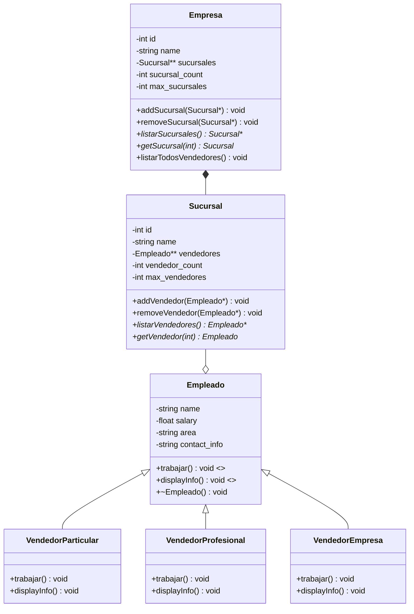
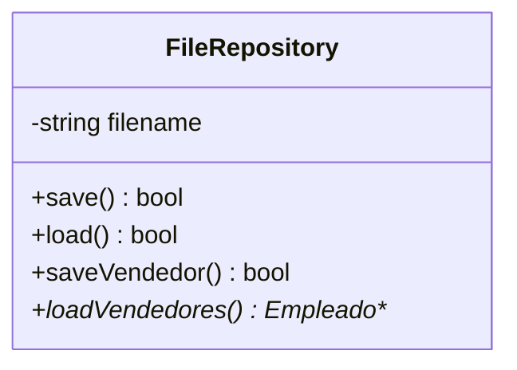
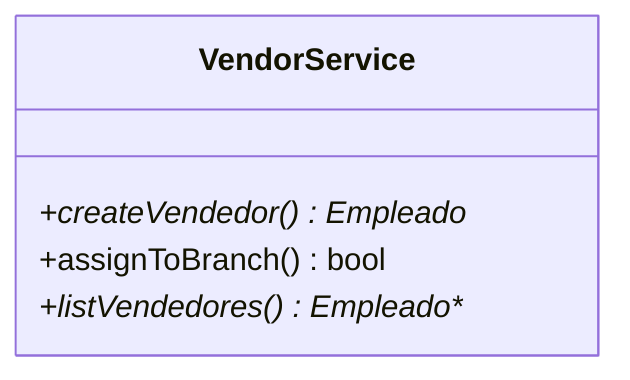
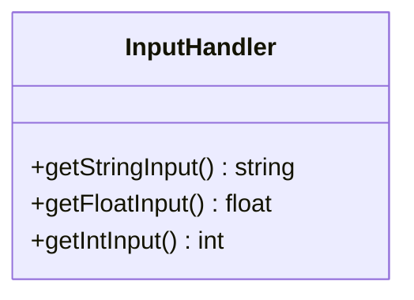

# Class Diagram: Vendor Management Application

## Core Class Hierarchy

## Persistence Layer

## Application Services

## Utility Classes

## Relationships

- **Inheritance**: VendedorParticular, VendedorProfesional, and VendedorEmpresa inherit from Empleado (abstract base class)
- **Composition**: Empresa "has" multiple Sucursal objects (Empresa is the owner of Sucursales)
- **Aggregation**: Sucursal "has" multiple Empleado objects (Sucursal aggregates Empleados)
- **Dependencies**: Main.cpp → (VendorService, InputHandler), VendorService → (Empleado*, Sucursal), FileRepository → (Empleado*)