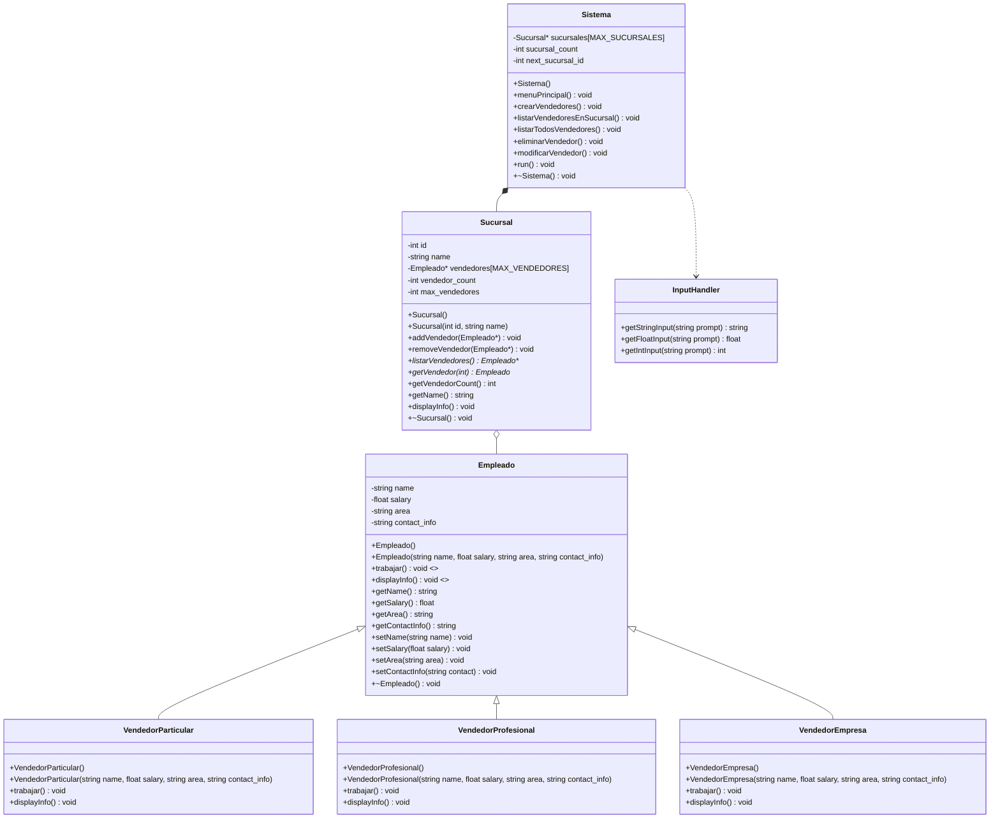

# Algoritmos y Estructuras de Datos I - Examen Final - Gestión de Vendedores

## Descripción

Este proyecto es una aplicación de consola en C++ que implementa un sistema de gestión de vendedores para una empresa. El sistema permite gestionar diferentes tipos de `Vendedores` (Particulares, Profesionales y de Empresa) que se asocian a `Sucursales`.

La arquitectura sigue el paradigma de **Programación Orientada a Objetos (POO)**, con una clara separación de responsabilidades. La gestión de datos se realiza manualmente sin el uso de la **Standard Template Library (STL)**, utilizando arrays estáticos en el stack para las colecciones principales y un array de punteros para la gestión polimórfica de `Vendedores`.

## Características

- **Gestión de Entidades**:
  - Clases para modelar el dominio: `Empleado`, `VendedorParticular`, `VendedorProfesional`, `VendedorEmpresa` y `Sucursal`.
  - Una clase `Sistema` que centraliza la lógica de negocio y la interacción con el usuario.
- **Programación Orientada a Objetos (POO)**:
  - **Abstracción**: Clase base abstracta `Empleado` con métodos virtuales puros (`trabajar()` y `displayInfo()`).
  - **Herencia**: Clases `VendedorParticular`, `VendedorProfesional` y `VendedorEmpresa` heredan de `Empleado`.
  - **Polimorfismo**: Uso de métodos virtuales para comportamientos específicos de cada tipo de vendedor.
  - **Encapsulamiento**: Atributos privados y métodos públicos/protected en todas las clases.
- **Gestión de Memoria y Relaciones**:
  - **Composición**: El `Sistema` gestiona el ciclo de vida de las `Sucursales`.
  - **Asociación**: Los `Vendedores` se asocian a `Sucursales` mediante punteros.
  - **Agregación**: Las `Sucursales` agrupan una colección de `Vendedores` mediante un array de punteros.
  - Las colecciones de `Sucursales` se almacenan en arrays en el **stack**.
  - La colección polimórfica de `Vendedores` se gestiona en el **heap** a través de un array de punteros.
- **Interfaz de Usuario por Consola**:
  - Menú de opciones interactivo para navegar por los módulos del sistema.
  - Operaciones CRUD completas para la gestión de vendedores (crear, listar, eliminar, modificar).
- **Modularidad y Calidad de Código**:
  - Código organizado en namespaces (`app`, `app::domain`, `app::utils`).
  - Estructura de proyecto basada en el layout **Pitchfork**.
  - Protección contra inclusiones múltiples con *include guards*.

## Estructura de directorios

```shell
.
├── compose.yaml
├── core-service
│   ├── build.sh
│   ├── compose.yaml
│   ├── data
│   ├── Dockerfile
│   ├── include
│   │   ├── app
│   │   │   └── Sistema.h
│   │   ├── domain
│   │   │   ├── Empleado.h
│   │   │   ├── Sucursal.h
│   │   │   ├── VendedorEmpresa.h
│   │   │   ├── VendedorParticular.h
│   │   │   └── VendedorProfesional.h
│   │   └── utils
│   │       └── helpers.h
│   ├── run.sh
│   └── src
│       ├── app
│       │   └── Sistema.cpp
│       ├── domain
│       │   ├── Empleado.cpp
│       │   ├── Sucursal.cpp
│       │   ├── VendedorEmpresa.cpp
│       │   ├── VendedorParticular.cpp
│       │   └── VendedorProfesional.cpp
│       ├── main.cpp
│       └── utils
│           └── helpers.cpp
├── Makefile
└── README.md
```

## Diagrama de Clases



## Uso

### Ejecución sin Docker (desde el directorio `core-service`)

Para compilar y ejecutar la aplicación directamente en tu sistema:

1. Navega al directorio `core-service`:

    ```bash
    cd ./core-service
    ```

2. Asegúrate de que los scripts tengan permisos de ejecución:

    ```bash
    chmod +x ./build.sh ./run.sh
    ```

3. Compila la aplicación. El script creará el directorio `build` si no existe.

    ```bash
    ./build.sh
    ```

4. Ejecuta la aplicación:

    ```bash
    ./run.sh
    ```

### Para despliegue con Docker (desde la raíz del proyecto)

Ejecutar el siguiente comando desde el directorio raíz:

```shell
# Con Make
make up-prod

# Con compose
docker compose up --build
```

### Para desarrollo con Docker (desde la raíz del proyecto)

Ejecutar:

```shell
# Con Make
make run-dev

# Con compose desde ./core-service
docker compose --profile interactive run --rm dev_interactive
```

### Funcionalidades del Sistema

Una vez ejecutada la aplicación, se presenta un menú interactivo con las siguientes opciones:

1. **Crear Vendedores (3 requeridos)**: Permite crear un vendedor de cada tipo (Particular, Profesional y Empresa).
2. **Listar Vendedores en Sucursal**: Muestra todos los vendedores asociados a una sucursal específica.
3. **Listar Todos los Vendedores**: Muestra todos los vendedores en todas las sucursales.
4. **Eliminar Vendedor**: Permite eliminar un vendedor seleccionado de la sucursal.
5. **Modificar Vendedor**: Permite modificar los datos de un vendedor seleccionado.

## Requisitos

- Compilador C++ (g++ recomendado).
- Docker y Docker Compose (opcional, para entornos contenerizados).
- `make` (opcional, para usar los atajos del Makefile).
- Un sistema operativo con terminal (Linux, macOS, o WSL en Windows).
