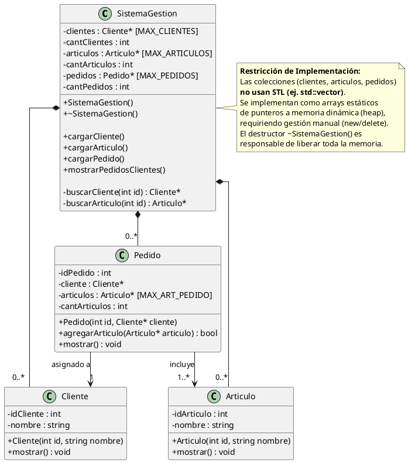

# Class Diagram 01
## TextUML

## UML
[![](https://img.plantuml.biz/plantuml/svg/bLPHRzCm47xFhpZrPMreotZj0rhLLQXI6TEw8II4aEjuxK5Y1ziPAWZ-otu0J_o4_Z7EiPsa1IfDchJaSdVVTv_lphqmbcbR5Nbo1gFH26PAtkEcqepZ_hU4jsWgbhilYVcCicIQ5S1pPipKMethoee5LtA5tmIS9rlC18YYj3ieHB4MsdIYSfJ2xae1IjkjIWBUfRX7YHwCWcUKMfWQBwbXO8N6YeAz4iQYal0z0HWH0nJIakE48kh75Dw_dhxxE5ikvbUtyzK7xyQadRMkA6rjfeAHLxbojcbu3l7Jczl5x6xvffDWsl6E6KgHOLPRhkkd47qzlrnSTcEl6pyVIN_FZYhg3shZptzOwm-SwGtJeOhWx6sHs87H8mPJeOpLqMQY4Z7t2DQLuMrkeWYO3JgQTfmQiDQhaIxv4Gyh18PJmYo-jyf9LQorCn0pb9kQvY61OVWKN0ygwJlS1uLP2nbPD9YDuJJeKK5FHFMIDfZXjKNaJU47MfxklD0_frglfXNEE19l9Y20UkvieqMtILguIC9LjLOg_s-fVa9lH4xBGCaubcV78xdn_nc873XoKfu6-G4p1dskXLyappDoqXMlNmQKWroiofW1afDgeoqaET9ZIOV0iMIvC6EO6wWexqmLfJ9-IOoJ8_IKAFREn-Eq5uKuuH55EE7YnNLbtibup9bOqrvpcnAOmOraP6DmTzNqUtzg5D7tQso5HPcBmPXIp8yLgLUSZo4zetAKhbJwIDTn4j17evVGUz6KHmVKQrdq3fdsIBsyseaU2QT0GR5_h4Ta_yltqLE8DeFqHAO7IZksaLFig2jbwQIDSZDvu_e2UQV1pgIY8ZLkjXRK_H4KPO0qROB2hR5mTHGaZYziagRERqaWNEKY9k_7MsFOpk4mhlA1pqoYLOQHDBTBw8jFOzeAsMJo8BXLUf2cJYfO2S06K194GUUWDTiProFxHqgjZ7CaPcL5W9g4P-v6L1f9MPJxnm8vZSTMi78mTAvQVAbG4prIiTRQLLOmwIxVlXHVQNvoOVrPkSCAuqIi_huvY8LFQKeb3LldmZ79aUvZQc0tTJHqaGub951mcYV91JtIJu4_)](https://editor.plantuml.com/uml/bLPHRzCm47xFhpZrPMreotZj0rhLLQXI6TEw8II4aEjuxK5Y1ziPAWZ-otu0J_o4_Z7EiPsa1IfDchJaSdVVTv_lphqmbcbR5Nbo1gFH26PAtkEcqepZ_hU4jsWgbhilYVcCicIQ5S1pPipKMethoee5LtA5tmIS9rlC18YYj3ieHB4MsdIYSfJ2xae1IjkjIWBUfRX7YHwCWcUKMfWQBwbXO8N6YeAz4iQYal0z0HWH0nJIakE48kh75Dw_dhxxE5ikvbUtyzK7xyQadRMkA6rjfeAHLxbojcbu3l7Jczl5x6xvffDWsl6E6KgHOLPRhkkd47qzlrnSTcEl6pyVIN_FZYhg3shZptzOwm-SwGtJeOhWx6sHs87H8mPJeOpLqMQY4Z7t2DQLuMrkeWYO3JgQTfmQiDQhaIxv4Gyh18PJmYo-jyf9LQorCn0pb9kQvY61OVWKN0ygwJlS1uLP2nbPD9YDuJJeKK5FHFMIDfZXjKNaJU47MfxklD0_frglfXNEE19l9Y20UkvieqMtILguIC9LjLOg_s-fVa9lH4xBGCaubcV78xdn_nc873XoKfu6-G4p1dskXLyappDoqXMlNmQKWroiofW1afDgeoqaET9ZIOV0iMIvC6EO6wWexqmLfJ9-IOoJ8_IKAFREn-Eq5uKuuH55EE7YnNLbtibup9bOqrvpcnAOmOraP6DmTzNqUtzg5D7tQso5HPcBmPXIp8yLgLUSZo4zetAKhbJwIDTn4j17evVGUz6KHmVKQrdq3fdsIBsyseaU2QT0GR5_h4Ta_yltqLE8DeFqHAO7IZksaLFig2jbwQIDSZDvu_e2UQV1pgIY8ZLkjXRK_H4KPO0qROB2hR5mTHGaZYziagRERqaWNEKY9k_7MsFOpk4mhlA1pqoYLOQHDBTBw8jFOzeAsMJo8BXLUf2cJYfO2S06K194GUUWDTiProFxHqgjZ7CaPcL5W9g4P-v6L1f9MPJxnm8vZSTMi78mTAvQVAbG4prIiTRQLLOmwIxVlXHVQNvoOVrPkSCAuqIi_huvY8LFQKeb3LldmZ79aUvZQc0tTJHqaGub951mcYV91JtIJu4_)

