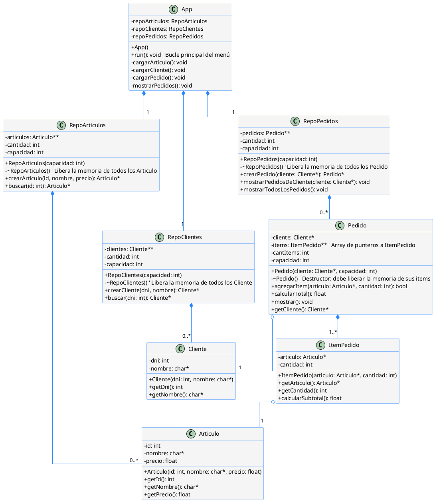

# Class Diagram 02

## TextUML

## UML
[![](https://img.plantuml.biz/plantuml/svg/bLXDRoCt4hthLn0AiEvMREKJYuLEqLYQG83ZCImxYxqrrKtBdEacE-pkIPnWzZ_iDRSSSyWXo2rN_R6yOfCjKf8tCmOCIsInwjMh3nRzLTDoqtPLEJfZ5nSNx5Ah1xdj3C_bxW_5lfLDnqlQ6JLlfAgvuHNBIzuqyxOrSjErOfLhjPO_2lPf859A9TgdMZ1jsaSTR1JYWNTb-rAhzffNWetNOgi5kr-D3msmdqOCFtDZzFUNkjI6VVJvF__rvSkNTlc5DeKm9zPv_cPhTASAj_VlHzcATQNVYD6xqQCi11DLtJwnIbGROPgHy_lwrTsShL-zk5sovHLRhDRBtVzUMR_Fb6u5umrRY4PkrJM-uGoRJ1OYbutKIZJmYYra8tQ_QvRS6AboMKlTGD_LQi7-mMv50xBot0gdiyc45D3lPrFe-KONNScD_D5n_iJMjpU17j8E3RLM3T_8KXQyOBkVbSovLuMV2tO5Y4HS3qUerWecsMKfyKLavooRcrRcNQdfyuqePA6p59wpYYlncYjMaWfT2eTqEkXU2vOR0Gbd8BiLjMvagutKq-aqOubuFUrNdRa6clFkYGFfzUfopio10r2o1IkmmmtiUhFaVp96pFaJUN7JGPNHpJW5Aqr7GOD93g-K-3xx92j4AU1QElM4Vaw4BbNEwmQSLWH5u-ZuMhFrtTKuvEjE5mXHYL_UPp8-DLgnsiYtdBQIxC9fzXnq3IZ8yaTk9XaOPcMt1NhWp9gscCqeo6gRxOzSGOlPCzNWZ4EcUf-hkXIlBHzGqaV1C4xUso3Mpdr7hwDsCa5veMm3jxyWjsz5oVl0iMI-DMBhykbjCqLPLmJ3BaHPCvc4M_1vSW6l8S7k6ru0OyTLePaesRW5OMDsURkSWz75SdrtU_-V9UFaoHXrsugnzvmKP_EwpjYa4TPDe8934yGmPYGw4QNFqL6AbDwy5XId8QcdR2qP13SQf15AKdu-h2XxAdSwsNUT6B8kikoAuIJSRDMAoWaScQlj-g51T9oghqAizoBJWF4mE4cc_uRm-_MSQNo13s8SqNqEtGQYo0Lcjrc72fLvQLl6M-GLaweGjL259U2qouyy5w3jGHXa9sgBJqZDymnxb_7H4SlG5y6i-05PYOMzizPGGD-pneR6T6IDgBIsuF7kDv9XIK6cURlxfTHRdPwoJlQ_dDhaLgXABbLhUq2kgQSMqh0m1azHUOpZya3PFtBRlaJB2ySspY8Cw03eITZP_MPasqsZPjotoZtFVO3YSaFG6xqn8YOfeHI2Z111ztbUOU39Nf-F7YaB-4x3DCHDnjaAQ4pB8KifEEyKrKYx-pMd-wMoqON7car4Gw7YdaAhxfpQE8ZO_KdIx46RYWIC4JbKKqlJY1LQ6W9Mw4egt1Ra2I_HrXHlqMZxraP6-uRXobFOEWffIPa1Su9KYQF-JcaPNfVZvGye3MmXH2jbSVMndR8beBYhkaPKeQ2FAkceTh-WFUbD1u_159A9qUNlPuJBuNPT-jjrmT6EKZidZFgfnQUo7Lykc2ncACBMVbQwGd1cp5uWTWK8qB5dxA7Kd6G-7eudxk1vVEeyFfBQCrlHheeazORimhKzHOlUcbs-iQTfkJVvpiDs2UDG5qe-3_jZBvnuiGEG0wg5ady3Qx2_ZxI3m1qHiu6IdhASzzplrUwF9YSEdSSd1cm3qMbimMvUkYCX-foNESrfwsxJedBA4oH63hZcEFDizV3jrJ0BCAFgpjWmy0mtFWz41hzN_M4V65G1qZhYml5mPFlyG3Yr2lxhn5D0MD2CskMubcS0ia41Iip7_N3cnou0f1lH-c3DSTjx3E5w7-vdwEkwZDYyYwcahKfJopQq-5RBOeY9IxeqOFJTSMb-JGt4tgp1ZEfAz8pQNIcehU6cfYlsUD94Du77vUwFBRMqmWqCKEY3J6gzXyr1iZQ1ywVJzMJK8fN9oKZ58XImAnkVW_2qmr3hXNksCRoReBNuWlNjvAW6q09pX40EWTjllmk9yEDQdFFDFaGVo8BNzpm9WyHxSE1aznG4ZSjJa4O5EdZkMzj1jkqzxql7EzuFHV3R5_M7kUsKFU-r5tWFfuUUuNn-hYMa0zYmwfoXXV1KdJetbAKxP9zIUEmCA9r8N9xClMXvoHBCPQtH9QvUm-FhiwuTfIRC-5bS8uF0vP1mOMuCspS-B067_JLRrqb_5PXEURpWzaMNbyBF4W1AeoRQnUvF5psp3UfepuJV2dhKmOxljC56pFWnQS5xpX9qPib9XfT1ogBNoj7RQaJYUCwnyMVZ0_eETmRY3ZSyPp1EZzcmfKP8_AlATjNu2OA_z7y5zmy9s8WRgBNswNGw6UzRLjHP0W5Vps7z1Tikyu7LNSJ-KKG3U-c6_OSEWw6W30nUnA1HMVxi3Gi51w-GcwDddXTsDft1dZeB9jZy_u2AtQyRMKPFzXwFz_PPDFZenxRrwklxPV06ye2qYwNNHLVWVjBw83X3T8xmhFmRRPXzenVQCRW0WWSuQ1zz1P6kAly2)](https://editor.plantuml.com/uml/bLXDRoCt4hthLn0AiEvMREKJYuLEqLYQG83ZCImxYxqrrKtBdEacE-pkIPnWzZ_iDRSSSyWXo2rN_R6yOfCjKf8tCmOCIsInwjMh3nRzLTDoqtPLEJfZ5nSNx5Ah1xdj3C_bxW_5lfLDnqlQ6JLlfAgvuHNBIzuqyxOrSjErOfLhjPO_2lPf859A9TgdMZ1jsaSTR1JYWNTb-rAhzffNWetNOgi5kr-D3msmdqOCFtDZzFUNkjI6VVJvF__rvSkNTlc5DeKm9zPv_cPhTASAj_VlHzcATQNVYD6xqQCi11DLtJwnIbGROPgHy_lwrTsShL-zk5sovHLRhDRBtVzUMR_Fb6u5umrRY4PkrJM-uGoRJ1OYbutKIZJmYYra8tQ_QvRS6AboMKlTGD_LQi7-mMv50xBot0gdiyc45D3lPrFe-KONNScD_D5n_iJMjpU17j8E3RLM3T_8KXQyOBkVbSovLuMV2tO5Y4HS3qUerWecsMKfyKLavooRcrRcNQdfyuqePA6p59wpYYlncYjMaWfT2eTqEkXU2vOR0Gbd8BiLjMvagutKq-aqOubuFUrNdRa6clFkYGFfzUfopio10r2o1IkmmmtiUhFaVp96pFaJUN7JGPNHpJW5Aqr7GOD93g-K-3xx92j4AU1QElM4Vaw4BbNEwmQSLWH5u-ZuMhFrtTKuvEjE5mXHYL_UPp8-DLgnsiYtdBQIxC9fzXnq3IZ8yaTk9XaOPcMt1NhWp9gscCqeo6gRxOzSGOlPCzNWZ4EcUf-hkXIlBHzGqaV1C4xUso3Mpdr7hwDsCa5veMm3jxyWjsz5oVl0iMI-DMBhykbjCqLPLmJ3BaHPCvc4M_1vSW6l8S7k6ru0OyTLePaesRW5OMDsURkSWz75SdrtU_-V9UFaoHXrsugnzvmKP_EwpjYa4TPDe8934yGmPYGw4QNFqL6AbDwy5XId8QcdR2qP13SQf15AKdu-h2XxAdSwsNUT6B8kikoAuIJSRDMAoWaScQlj-g51T9oghqAizoBJWF4mE4cc_uRm-_MSQNo13s8SqNqEtGQYo0Lcjrc72fLvQLl6M-GLaweGjL259U2qouyy5w3jGHXa9sgBJqZDymnxb_7H4SlG5y6i-05PYOMzizPGGD-pneR6T6IDgBIsuF7kDv9XIK6cURlxfTHRdPwoJlQ_dDhaLgXABbLhUq2kgQSMqh0m1azHUOpZya3PFtBRlaJB2ySspY8Cw03eITZP_MPasqsZPjotoZtFVO3YSaFG6xqn8YOfeHI2Z111ztbUOU39Nf-F7YaB-4x3DCHDnjaAQ4pB8KifEEyKrKYx-pMd-wMoqON7car4Gw7YdaAhxfpQE8ZO_KdIx46RYWIC4JbKKqlJY1LQ6W9Mw4egt1Ra2I_HrXHlqMZxraP6-uRXobFOEWffIPa1Su9KYQF-JcaPNfVZvGye3MmXH2jbSVMndR8beBYhkaPKeQ2FAkceTh-WFUbD1u_159A9qUNlPuJBuNPT-jjrmT6EKZidZFgfnQUo7Lykc2ncACBMVbQwGd1cp5uWTWK8qB5dxA7Kd6G-7eudxk1vVEeyFfBQCrlHheeazORimhKzHOlUcbs-iQTfkJVvpiDs2UDG5qe-3_jZBvnuiGEG0wg5ady3Qx2_ZxI3m1qHiu6IdhASzzplrUwF9YSEdSSd1cm3qMbimMvUkYCX-foNESrfwsxJedBA4oH63hZcEFDizV3jrJ0BCAFgpjWmy0mtFWz41hzN_M4V65G1qZhYml5mPFlyG3Yr2lxhn5D0MD2CskMubcS0ia41Iip7_N3cnou0f1lH-c3DSTjx3E5w7-vdwEkwZDYyYwcahKfJopQq-5RBOeY9IxeqOFJTSMb-JGt4tgp1ZEfAz8pQNIcehU6cfYlsUD94Du77vUwFBRMqmWqCKEY3J6gzXyr1iZQ1ywVJzMJK8fN9oKZ58XImAnkVW_2qmr3hXNksCRoReBNuWlNjvAW6q09pX40EWTjllmk9yEDQdFFDFaGVo8BNzpm9WyHxSE1aznG4ZSjJa4O5EdZkMzj1jkqzxql7EzuFHV3R5_M7kUsKFU-r5tWFfuUUuNn-hYMa0zYmwfoXXV1KdJetbAKxP9zIUEmCA9r8N9xClMXvoHBCPQtH9QvUm-FhiwuTfIRC-5bS8uF0vP1mOMuCspS-B067_JLRrqb_5PXEURpWzaMNbyBF4W1AeoRQnUvF5psp3UfepuJV2dhKmOxljC56pFWnQS5xpX9qPib9XfT1ogBNoj7RQaJYUCwnyMVZ0_eETmRY3ZSyPp1EZzcmfKP8_AlATjNu2OA_z7y5zmy9s8WRgBNswNGw6UzRLjHP0W5Vps7z1Tikyu7LNSJ-KKG3U-c6_OSEWw6W30nUnA1HMVxi3Gi51w-GcwDddXTsDft1dZeB9jZy_u2AtQyRMKPFzXwFz_PPDFZenxRrwklxPV06ye2qYwNNHLVWVjBw83X3T8xmhFmRRPXzenVQCRW0WWSuQ1zz1P6kAly2)