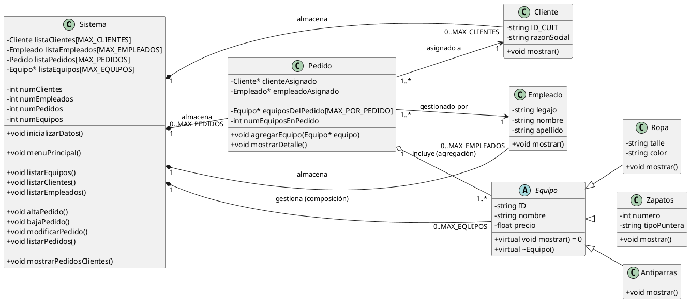

# Class Diagram 01
## TextUML

## UML
[![](https://img.plantuml.biz/plantuml/svg/bLRRRjj647tNLmpueaih8RBJF0Hj4LLaNHLseienKBG8WX6vKZPPxZBBPGexRV-b7z2dV89_hBCNKbnRCLAzYBkSovdR6Jwh3MhJb68mXEbq2aibTtpVQCpvxIS91HEGSjnhB1566xR3t2ZDRx1GOojFMZzWJITW4cgrCt-WPbFDtZTSiv99CwqhblCTpz5m9MTb0IEwvGKMh8Otg8jS5GmBhCS3mNO6Z0BDzsyC56GWjpg3-XsN5H82o0NMzS8OpRUDOQjSoKj-m-3H881FsOvBtYA79OcJ5mjpu5JXajU6KIGV1q2_8In4YJcJM782HJ7KvlOVmtCVZS7y7OoU_xYPNio_1lT_CdQAqwMm2Wm4sSDmg7-_MFpwUdc-ofw_p2vVUS6ih0IpwN6IxScBPXVhysoHlcXbrwpWhQH_zdBhB5rrKeHPQxosuLKDUTMg1WI1iALO0zhJW3AZAbHg4doxG_3yozLgtLhqibmQa4tPnX9TTh2Zsm0nblHE3dQ7i4IzHmktG4DOknJN0UpiiKVxrGV52t3bGq4DfbChFnhtRPsHjYlk6PDCeu0HMJYRzmrGppLhpMNEAnInziNjfw8Hv3ZhORXKGi6vJP3kct4fqo6SqVqtRPwElEgoTTGxXBJ1QBcvIcdShBIXONAXdFJDeMZx8FAonRV7hajLk37JHzvvOC7pSLWRLYbD0JaScpYbgZQwK-z5_bSxLkqu-B6QaZYNUrYbhvTNgvVHdSOR6bfbQtpVGzzaDpYnJS7s-5P5LrALMysYAwoO40JsOHTXtbeks311fASavO2wTL5Ra9vANADkJZq7R1w7_szYBfWGExc7HStt4eFpZW0cmC9Jz3xo7MXhiTSKPT_rapi3pNnVfapu63nDlDW4gdXrR2OpwMKFRaENEM-XrKUnXoDTa3A3GZ2VHy-wFzCewlVDxRzkp7zYcj7qkUVWsZFmqFEntHSKuzPQomtw21T4MHYk83I0qxtNKfyj_KueD53Hqk1jtJajDYA9kFxm7UsBwFtV8VOGKjWQATFyWrrC1uGUs4PLU0UMIqbqanEjw8VRxpUi72D-ZAf5X1wR9cHhH_JuiBa5RLNQaXfRYqSaZw_9NkE7GirdXp9sqOU2VFidMR0vY2v2CD7T0P6rUJ9pPATgtkzi8hmXPA9Rp0djT4DZn18Yo9xu62nnMsFNDPH8Uu0Mtw3JcYSm8O_9ezciluIJZfcU4flwLVzPfMuT9mVo-GAri9sJbaw-n9DVlqdRuqyXsTlDfYIbE-z7dTZCdSvYRXAjgr7CH-7_YKrfH5-DRByLneEWcindiqb2zVxUeJkaAS50Ju39_xVJIrmN4frejJXZVMB3kvynFPi9A9ikR_kG9Dhgehcchnmy6B8fUiPaGL-m_m40)](https://editor.plantuml.com/uml/bLRRRjj647tNLmpueaih8RBJF0Hj4LLaNHLseienKBG8WX6vKZPPxZBBPGexRV-b7z2dV89_hBCNKbnRCLAzYBkSovdR6Jwh3MhJb68mXEbq2aibTtpVQCpvxIS91HEGSjnhB1566xR3t2ZDRx1GOojFMZzWJITW4cgrCt-WPbFDtZTSiv99CwqhblCTpz5m9MTb0IEwvGKMh8Otg8jS5GmBhCS3mNO6Z0BDzsyC56GWjpg3-XsN5H82o0NMzS8OpRUDOQjSoKj-m-3H881FsOvBtYA79OcJ5mjpu5JXajU6KIGV1q2_8In4YJcJM782HJ7KvlOVmtCVZS7y7OoU_xYPNio_1lT_CdQAqwMm2Wm4sSDmg7-_MFpwUdc-ofw_p2vVUS6ih0IpwN6IxScBPXVhysoHlcXbrwpWhQH_zdBhB5rrKeHPQxosuLKDUTMg1WI1iALO0zhJW3AZAbHg4doxG_3yozLgtLhqibmQa4tPnX9TTh2Zsm0nblHE3dQ7i4IzHmktG4DOknJN0UpiiKVxrGV52t3bGq4DfbChFnhtRPsHjYlk6PDCeu0HMJYRzmrGppLhpMNEAnInziNjfw8Hv3ZhORXKGi6vJP3kct4fqo6SqVqtRPwElEgoTTGxXBJ1QBcvIcdShBIXONAXdFJDeMZx8FAonRV7hajLk37JHzvvOC7pSLWRLYbD0JaScpYbgZQwK-z5_bSxLkqu-B6QaZYNUrYbhvTNgvVHdSOR6bfbQtpVGzzaDpYnJS7s-5P5LrALMysYAwoO40JsOHTXtbeks311fASavO2wTL5Ra9vANADkJZq7R1w7_szYBfWGExc7HStt4eFpZW0cmC9Jz3xo7MXhiTSKPT_rapi3pNnVfapu63nDlDW4gdXrR2OpwMKFRaENEM-XrKUnXoDTa3A3GZ2VHy-wFzCewlVDxRzkp7zYcj7qkUVWsZFmqFEntHSKuzPQomtw21T4MHYk83I0qxtNKfyj_KueD53Hqk1jtJajDYA9kFxm7UsBwFtV8VOGKjWQATFyWrrC1uGUs4PLU0UMIqbqanEjw8VRxpUi72D-ZAf5X1wR9cHhH_JuiBa5RLNQaXfRYqSaZw_9NkE7GirdXp9sqOU2VFidMR0vY2v2CD7T0P6rUJ9pPATgtkzi8hmXPA9Rp0djT4DZn18Yo9xu62nnMsFNDPH8Uu0Mtw3JcYSm8O_9ezciluIJZfcU4flwLVzPfMuT9mVo-GAri9sJbaw-n9DVlqdRuqyXsTlDfYIbE-z7dTZCdSvYRXAjgr7CH-7_YKrfH5-DRByLneEWcindiqb2zVxUeJkaAS50Ju39_xVJIrmN4frejJXZVMB3kvynFPi9A9ikR_kG9Dhgehcchnmy6B8fUiPaGL-m_m40)